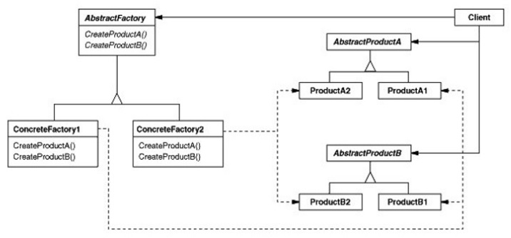

#
# Abstract Factory
## Padrão Criacional

### Intenção
A ideia desse padrão é diminuir o acoplamento entre objetos e prover interfaces para criação de famílias de objetos sem revelar sua implementação.
Este padrão é similar ao *Factory Method*, porém nesse caso, há uma camada extra de abstração. Aqui há fábricas que abstraem a criação de objetos concretos, e essas fábricas também possúem suas criações abstraídas.

### Motivação
Imagine que exista em nosso código a criação de mesas e cadeiras. Até aí tudo bem. Porém essas mesas e cadeiras possuem linhas diferentes de produção, e há uma linha com visual rústico e antigão, e outra linha com visual moderno, refinado e limpinho. Ficaria meio estranho se houvesse apenas uma *factory* responsável por criar mesas e outra cadeiras, sendo que nossos produtos têm famílias diferentes. Felizmente isso é facilmente organizado utilizando este padrão, que pode fazer com que haja uma fábrica responsável por criar nossos produtos rústicos e outra responsável por criar nossos produtos modernos, e, descendo mais um nível, haverá dentro de cada família, uma factory para criação de mesas e outra para cadeiras.

### Aplicabilidade
- Quando houver no sistema a representação de várias famílias de produtos
- Ao criar bibliotecas de código onde se deseja esconder a implementação

### Estrutura

- *Diagrama do padrão*

### Participantes
- Client: quem usa nossa linda fábrica abstrata
- AbstractFactory: essa é a interface que representa uma fábrica concreta
- ConcreteFactory1, - ConcreteFactory2: são as fábricas responsáveis por criar diferentes famílias de produtos
- AbstractProductA, - AbstractProductB: são as interfaces que representam os produtos
- ProductA1, ProductA2, ProductB1, ProductB2: são os produtos finais, que derivam de famílias diferentes

### Exemplo
[Neste link](./exemplo) segue um exemplo de código para um simples sistema de uma poderosa indústria criadora de microprocessadores, com diversas famílias de produtos.
