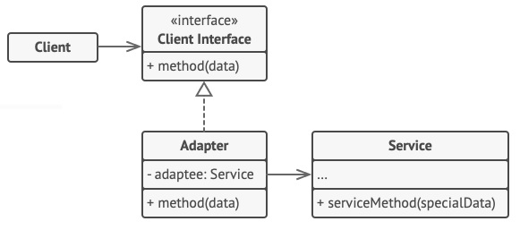

#
# Adapter
## Padrão Estrutural

### Intenção
O objetivo do *Adapter* é garantir a interação entre sistemas isolados ou partes isoladas de código.

### Motivação
O motivo principal da existência desse padrão é pela dificuldade de se integrar sistemas geralmente legados ou bibliotecas a um outro sistema. Nesses casos onde fica inviável modificar os sistemas para que eles conversem - seja pela complexidade, ou por ser inpossível obter o código fonte - é criado um adaptador que funciona como intermediário fazendo a conversão da comunicação entre eles.

### Aplicabilidade
- Quando se precisa interligar um sistema legado a um sistema novo;
- Ao usar uma biblioteca (geralmente legada) a um novo sistema, sem grandes impactos ao sistema;
- Para compatibilizar um sistema com APIs e serviços externos; etc.

### Estrutura
Existem duas formas de se implementar este padrão. Com um adaptador de *objetos* ou com um adaptador de *classe*.

O adaptador-objeto implementa a interface que será usada pelo cliente além de compor a classe que será adaptada.

- *Adaptador de objetos*

Já o adaptador de classe faz uso de uma herança múltipla. Ele herda ao mesmo tempo os métodos da classe alvo do cliente e da classe a ser adaptada. Assim, ele realiza as conversões necessárias com o acesso aos métodos de ambas as classes.

- *Adaptador de classe*

### Participantes
No adaptador de objetos temos os seguintes:
- Service: O recurso da qual precisa ser adaptado
- Client interface: A interface que define como a classe precisa se comportar para ser usada pelo cliente
- Adapter: A cerejinha do bolo. Esta implementa a interface que o cliente precisa utilizar e faz todas as conversões necessárias para interligação com o Service. Aqui o Service está composto dentro do Adapter
- Client: Quem usará o adaptador

Já no adaptador de classe, temos:
- Service: O recurso da qual precisa ser adaptado
- 
- Client: Quem usará o adaptador

### Exemplo
[Aqui](./exemplo) segue o código de uma objeto *Singleton* que constrola a exibição de frases em um painel. Repare que, nesse exemplo, as chamadas de instâncias realizadas duas vezes, porém as instâncias permanecem as mesmas.
