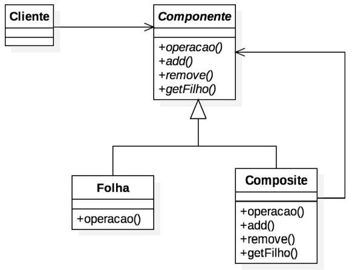
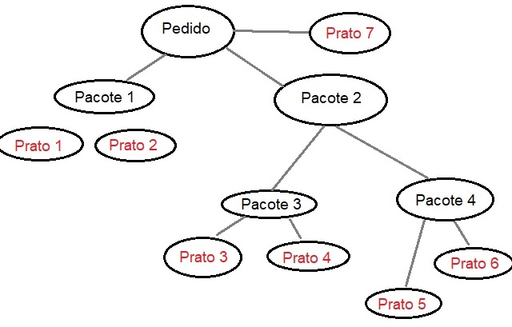

# Composite Pattern
## Padrão estrutural

### Intenção
Este padrão é usado para estruturar uma árvore com objetos semelhantes, de forma que a árvore fique uniforme e homogênea. O cliente que usará dos atributos de uma estrutura Composite consegue ter acesso a todos os objetos da árvore através de um único objeto.

### Motivação
Imagine o caso de restaurante de hotel que vende suas refeições por pacotes, mas também vende suas refeições de maneira avulsa, e cada cliente pode contratar vários pacotes e também várias pratos de forma separada, e no final, o preço de tudo é computado no pedido do cliente.
Neste cenário os pedidos do cliente podem ser organizados em forma de árvore, uma vez que ele pode solicitar vários pacotes com vários pratos.

### Aplicabilidade
O padrão composite é aplicavel a todos os casos em que seja necessário usar uma estrutura de árvore/hierarquia com funcionalidades genéricas por toda a estrutura, como registros gerais, estruturas de arquivos, etc.

### Estrutura

### Participantes
Component: Esta será a "classe molde" para todos os objetos da árvore. Essa classe pode tanto ser uma interface como uma classe abstrata
Composite: São todos os objetos da árvore, exceto as folhas e o nó raíz
Leaf: São os objetos da árvore que não têm filhos
Cliente: As classes que usarão os recursos da estrutura

[Código de exemplo](./exemplo)
