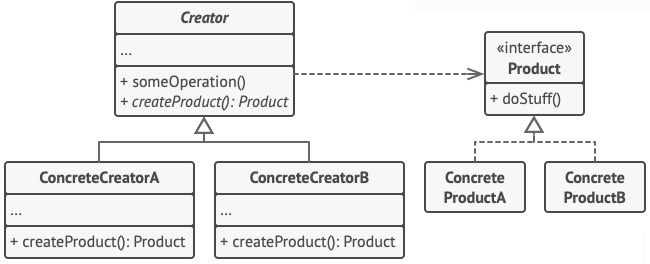

#
# Factory Method
## Padrão Criacional

### Intenção
TEM QUE FAZER TUDÃO.

### Motivação
TUDÃO.

### Aplicabilidade
- Quando houver no sistema a representação de várias famílias de produtos
- Ao criar bibliotecas de código onde se deseja esconder a implementação

### Estrutura

- *Diagrama do padrão*

### Participantes
- Client: quem usa nossa linda fábrica abstrata
- AbstractFactory: essa é a interface que representa uma fábrica concreta
- ConcreteFactory1, - ConcreteFactory2: são as fábricas responsáveis por criar diferentes famílias de produtos
- AbstractProductA, - AbstractProductB: são as interfaces que representam os produtos
- ProductA1, ProductA2, ProductB1, ProductB2: são os produtos finais, que derivam de famílias diferentes

### Exemplo
[Neste link](./exemplo) segue um ex.
