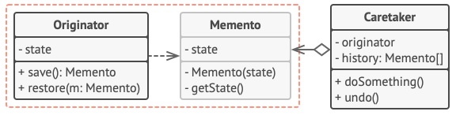

#
# Memento
## Padrão Comportamental

### Intenção
Este padrão permite que você salve o estado de um objeto sem violar seu encapsulamento e sem conhecer sua implementação.

### Motivação

### Aplicabilidade
- Quando um objeto precise de pontos de restauração para um estado anterior; ou
- Para fazer tratativas para que o objeto se recupere de erros

### Estrutura

- *Diagrama do padrão*

### Participantes
- Subject: Esta é o objeto que tem um estado que precisa ser observado
- Observer: A interface que define os métodos de notificação de interesse dos observadores
- Observer_3, Observer_3, Observer_3, etc.: São as classes concretas que observam o estado da classe *Subject*

### Exemplo
[Aqui](./exemplo) segue um exemplo .
