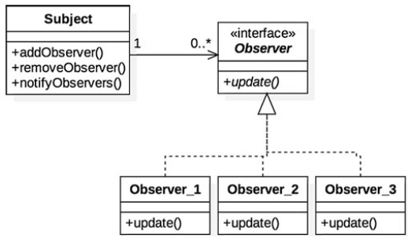

#
# Observer
## Padrão Estrutural

### Intenção
Este padrão define uma forma de comunicação que permite que objetos sejam notificados caso haja alguma mudança de estado relevante.

### Motivação
Imagine que uma loja online venda produtos muito bons e foi lançado um novo smartphone cheio de funções incríveis e desnecessárias que em breve estará disponível para venda. Esta loja possui também diversos clientes que tem certo problema com ansiedade e precisam ser os primeiros a comprar o novo celular. Até que o novo celular fique disponível a venda na loja a marioria das visitas dos clientes ao site será totalmente em vão. O padrão observer se encaixa perfeitamente como solução para este cenário. Para sua implementação, poderia ser criada uma lista de assinantes, os quais desejam ser avisados assim que o celular estiver disponível. Assim que o novo aparelho entrar no estoque e puder ser vendido todos os clientes que estão com assinatura registrada na loja seriam notificados.

### Aplicabilidade
Em qualquer caso em que a mudaça de estado de um objeto requer que algo seja feito em outros objetos e, nós não sabemos quem são estes objetos.

### Estrutura

- *Diagrama do padrão*

### Participantes
- Subject: Esta é o objeto que tem um estado que precisa ser observado
- Observer: A interface que define os métodos de notificação de interesse dos observadores
- Observer_3, Observer_3, Observer_3, etc.: São as classes concretas que observam o estado da classe *Subject*

### Exemplo
[Aqui](./exemplo) segue.
