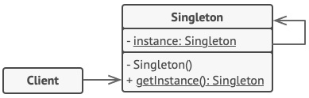

#
# Singleton Pattern
## Padrão Criacional

### Intenção
O objetivo do *Singleton* é garantir que somente uma instância de um objeto seja instanciada no ciclo de vida da aplicação.

### Motivação
Este padrão é muito útil para controlar o acesso de recursos compartilhados de maneira centralizada, como uma conexão com banco de dados ou acesso a um arquivo.

### Aplicabilidade
Pode ser usado em qualquer caso em que o construtor de uma classe precise ser protegido.

### Estrutura

- *Diagrama estrutural do padrão*

### Variações
- Eager: Faz com que o objeto *Singleton* seja instanciado assim que a aplicação é carregada. Pode parar a aplicação caso a criação da instância dispare alguma excessão
- Static Block: Assim como o Eager, faz com que o objeto seja inicializado assim que a aplicação é carregada, porém utilizando de uma estrutura 'try .. catch' para tratar alguma possível excessão na criação do objeto
- Lazy: Faz com que o objeto seja criado apenas quando uma instância seja solicitada através do método 'getInstance'

### Participantes
- Classe Singleton: A única classe que implementa o método, que possui o construtor protegido e o método 'getInstance' implementado
- Classes clientes: As classes que fazem uso do objeto instanciado

[Código de exemplo](./exemplo)
