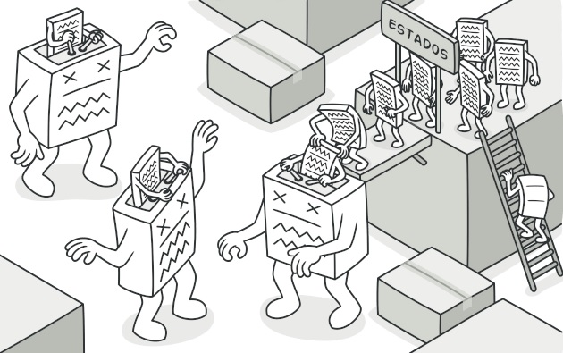
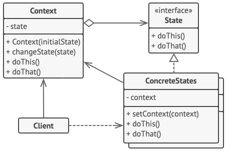

# Stare
## Padrão comportamental

### Intenção
Com esse padrão, criamos uma máquina de estados, onde dependendo do estado em que se encontra nosso lindo objeto, ele terá comportamentos diferentes - é quase como se ele se comportasse como outro.

- *Analogia do funcionamento do padrão. Fonte: <https://refactoring.guru/pt-br/design-patterns/state>*

### Motivação
A implementação do algoritmo de uma cafeteira grande que prepare café e chá. Várias tarefas são comuns entre preparar ambas as bebidas, mas há algumas particularidades. Dessa forma, poderia haver uma super classe que contenha a implementação de todos os métodos genéricos e os métodos especializados ficariam nas classes filhas.

### Aplicabilidade
Pode ser usado quando o algoritmo pode ser dividido em etapas de forma hierárquica.

### Estrutura

- *Diagrama estrutural do padrão*

### Participantes
- Classe abstrata: Contendo todos as etapas genéricas para execução do algoritmo
- Classes concretas: Que fazem uso do código genérico da classe abstrata, podendo altera-los e especializa-los conforme a necessidade

[Código de exemplo](./exemplo)
