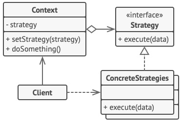

# Strategy/Policy
## Padrão Comportamental

### Intenção
A ideia principal do *Strategy* é delegar responsabilidades, fazendo com que o código fique mais coeso.

### Motivação
Imagine que você tenha um código que precise executar algorimos diferentes para atividades semelhantes, como por exemplo, calcular o valor da mensalidade de alunos de uma faculdade, sendo que há alunos que sejam bolsistas, gradistas, ou de transferência, e para cada caso um algoritmo diferente tem de ser executado. Nesse caso ao invés de implementar todo o cálculo do valor da mensalidade para todos os casos em apenas uma classe, o cálculo será delegado para classes especializadas conforme cada caso.

### Aplicabilidade
- Quando a classe tem um operador condicional muito grande que troca entre diferentes variantes do mesmo algoritmo.
- Para isolar a lógica do negócio de uma classe dos detalhes de implementação de algoritmos que podem não ser tão importantes no contexto da lógica.
- Quando você tem muitas classes parecidas que somente diferem na forma que elas executam algum comportamento.
- Quando você quer usar diferentes variantes de um algoritmo dentro de um objeto e ser capaz de trocar de um algoritmo para outro durante a execução.

### Estrutura

- *Diagrama estrutural do padrão*

### Participantes
- Context: Este usa e mantém uma referência de algum objeto Strategy que será usada pelos clientes
- Strategy: Essa é a interface para comum para uso dos algoritmos
- ConcreteStrategies: Aqui é onde se encontra os algorimos especializados para uso no código
- Client: Este é o dito cujo que fará uso de novo belo código

### Exemplo
Aqui [neste link](./exemplo) encontra-se um exemplo de código usado por um banco qualquer.
Nesse código os clientes podem fazer empréstimos, que são diferenciados caso o cliente seja um bom pagador, ou um mau pagador.
Nesse exeplo os participantes do padrão são definidos como.

- Main - Client
- Pagador - Strategy
- Emprestimo - Context
- PagadorBom, PagadorMeiaBoca e PagadorRuim - ConcreteStrategies
